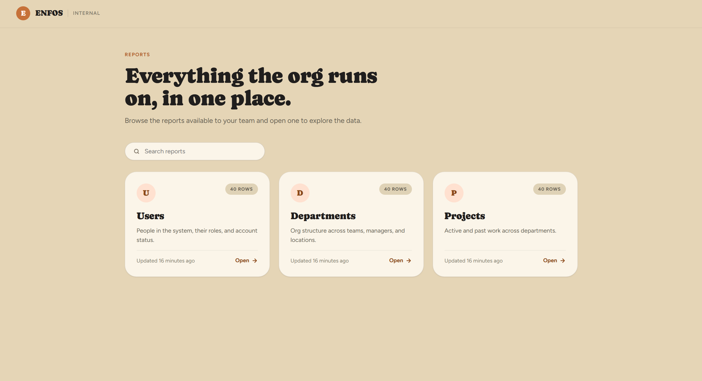

# Enfos Reporting Portal

A full-stack internal reporting portal: a React frontend backed by a Spring Boot API. 

---

## Quick start

**Prerequisite:** [Docker Desktop](https://www.docker.com/products/docker-desktop/) (with Docker
Compose, included by default).

From the repository root:
```
docker compose up --build
```

That's it — one command builds and starts both services:
- Frontend: **http://localhost:5173**
- Backend API: **http://localhost:8080**

No local Java, Maven, or Node installation is required — everything runs inside containers. The
backend seeds its own in-memory database with mock data on startup, so there's nothing else to
configure.

To stop everything: `Ctrl+C`, then `docker compose down`.

---

## Running without Docker

Useful for active development (hot reload, debugging).

**Backend** (requires Java 17+):
```
cd backend
./mvnw spring-boot:run
```
Starts on port 8080.

**Frontend** (requires Node 20+):
```
cd frontend
npm install
npm run dev
```
Starts on port 5173. Must be run on this exact port — the backend's CORS configuration only
allows `http://localhost:5173` as an origin. 

Run the two in separate terminals; the frontend needs the backend running to load any data.

---

## Tech stack

| | |
|---|---|
| Backend | Java 21, Spring Boot 4.1, Spring Data JPA, H2 (in-memory) |
| Frontend | React 19, TypeScript, Vite, React Router |
| Backend tests | JUnit 5, MockMvc (17 tests) |
| Containerization | Docker (multi-stage builds), Docker Compose, nginx (serves the built frontend) |

---

## API reference

| Method | Endpoint | Returns |
|---|---|---|
| GET | `/api/reports` | Catalog of the 3 reports — id, name, description, live row count, live last-updated timestamp |
| GET | `/api/reports/users` | Paginated Users rows |
| GET | `/api/reports/departments` | Paginated Departments rows |
| GET | `/api/reports/projects` | Paginated Projects rows |

Full reference — request parameters, sortable fields per report, response field types/nullability,
error shapes, and example JSON — is in **[backend/README.md](backend/README.md)**.

---

## Reports

| Report | Columns |
|---|---|
| **Users** | User ID, Name, Email, Role, Status, Created Date, Updated |
| **Departments** | Department ID, Department Name, Manager, Employee Count, Location, Updated |
| **Projects** | Project ID, Project Name, Department, Owner, Status, Start Date, End Date, Updated |

Each report is seeded with 40 mock rows on backend startup, deliberately mixed in quality: ~70%
complete/realistic, ~15% with missing optional fields, ~10% malformed/edge-case values (long
names, invalid emails, unicode/emoji, extreme dates), and ~5% nearly-empty rows. This is
intentional — the point is to demonstrate the frontend handling real-world-messy data gracefully
rather than assuming it's always clean. See [backend/README.md](backend/README.md#mock-data) for
the exact breakdown.

---

## Project structure

```
backend/    Spring Boot API (controller -> service -> repository -> H2)
frontend/   React + TypeScript SPA (pages -> components, typed API client)
docker-compose.yml   Runs both together
```

Each side has its own `Dockerfile`. See [backend/README.md](backend/README.md) for the full API
reference.

---

## Assumptions & tradeoffs

- **Database is in-memory (H2), not persistent.** Real Spring
  Data JPA is used, so swapping in a real database later is a
  datasource configuration change, not a rewrite — the `postgresql` driver is already on the
  backend's classpath, unused, for exactly this reason.
- **Report search is client-side.** The spec requires searching/filtering reports by name on the
  landing page; with only 3 hardcoded reports, filtering them in the browser is simplest. If the
  report catalog needs to scale up significantly, that search should move to a real backend
  endpoint instead.
- **No authentication.** This is a read-only internal reporting demo.
- **Report row endpoints return the underlying data directly** (via response DTOs matching the
  API contract) rather than routing through a separate business-rules layer, since these are
  simple read-only reports.
- **`status` fields are typed as a plain string, not a restricted enum**, both in the database
  and in the API response. See [backend/README.md](backend/README.md#status-fields).
- **Sorting is restricted to a specific whitelist of fields per report**, not "any column."
  Requesting an unsupported sort field returns a `400` rather than being silently ignored or
  causing a database error — a deliberate API design choice, not an oversight.

---

## Screenshots / demo

**Landing page** — browse the available reports:



**Filtering reports by name** 


**Report tables** — sortable, paginated:


**Missing/placeholder values rendered thoughtfully**, not just left blank (e.g. "No role
assigned" in italics, shown here on the Users report):


**Loading state:**


**Error states** — shown here by stopping the backend while the frontend keeps running:


